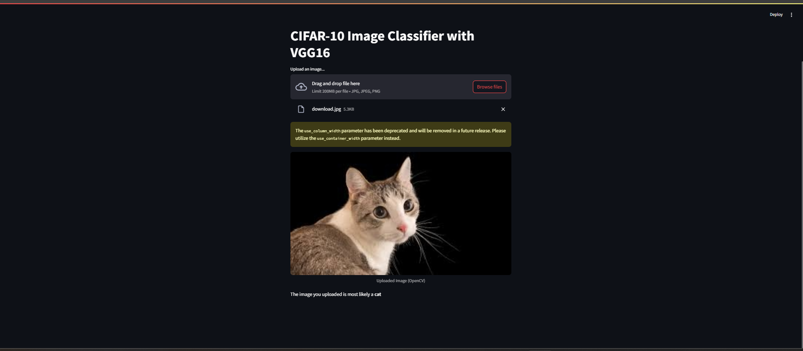

# 🧠 CIFAR-10 Image Classifier with VGG16 and Streamlit

A user-friendly web application that classifies images using a VGG16 model trained on the CIFAR-10 dataset. Built with PyTorch and Streamlit.


📂 Project Structure

├── app.py                 # Streamlit web app for image classification

├── scripts/

│   ├── test.py            # Script to test model accuracy on CIFAR-10 test set

│   └── train.py           # (Optional) Script to train the VGG16 model on CIFAR-10

├── model/

│   ├── vgg16_cifar10.pth  # Pretrained VGG16 model trained on CIFAR-10

│   └── model.md           # Instructions to download the pretrained model

└── requirements.txt       # Required Python dependencies


## 📸 Screenshot




## ⚙️ Features

* ✅ Classify CIFAR-10 images in real time via web interface
* 📈 Evaluate model performance on test dataset
* 👁️ Visual feedback of uploaded images and predictions
* 💡 Simple UI powered by Streamlit


## 🧰 Requirements

Make sure Python 3.8+ is installed. Then run:

```bash
pip install -r requirements.txt
```

### Dependencies

* torch
* torchvision
* streamlit
* numpy
* opencv-python


## 🚀 How to Use

1. Follow the instructions in `model/model.md` to download the pretrained model and place it in the `model/` directory.
2. Start the Streamlit app:

   ```bash
   streamlit run app.py
   ```
3. Upload an image (JPG/PNG) of a CIFAR-10 object.
4. View the prediction result directly in the browser.

To evaluate model accuracy:

```bash
python scripts/test.py
```

To train the model from scratch:

```bash
python scripts/train.py
```


## 📊 CIFAR-10 Classes


airplane, automobile, bird, cat, deer,
dog, frog, horse, ship, truck


## 📖 Notes

* The input images are resized and normalized to match VGG16 input specifications.
* This tool runs the model in CPU mode by default; adjust for GPU if needed in `scripts/test.py`.


